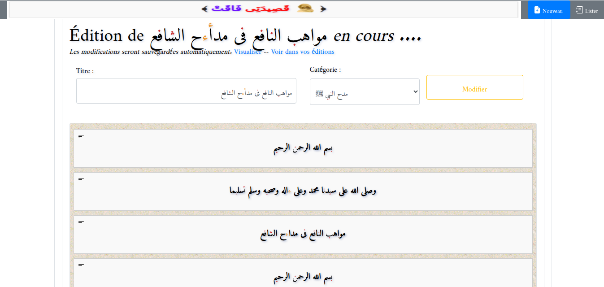
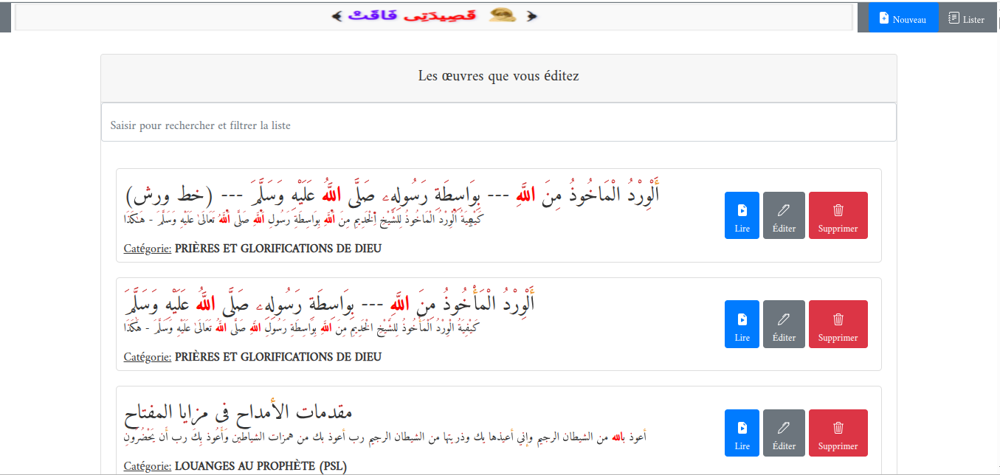
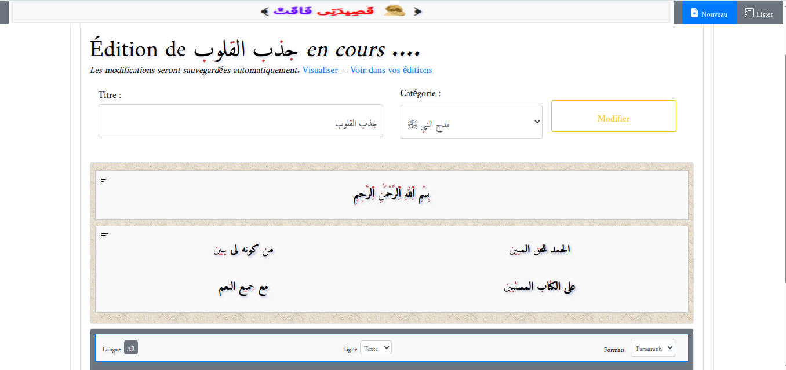
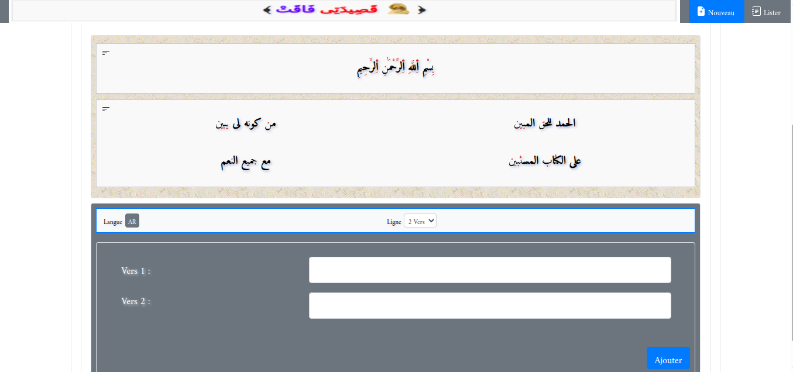
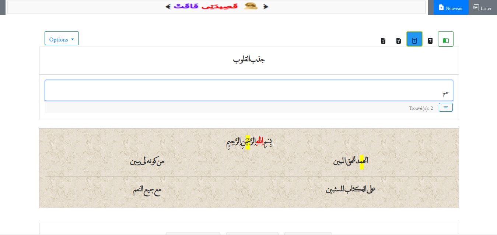

# **KsEditor — Éditeur & Visionneuse de Khassaïdes**

KsEditor est une application web avancée permettant **de consulter, éditer, gérer et styliser des Khassaïdes** (poèmes religieux), avec une interface moderne, rapide et optimisée pour mobiles et ordinateurs.

Développé entièrement en **PHP, SQLite/MySQL, jQuery, Bootstrap**, KsEditor propose une expérience complète pour les lecteurs, éditeurs, enseignants ou administrateurs de contenus Mourides.

---

## ✨ **Fonctionnalités principales**

### 🔍 **1. Visionneuse avancée de Khassaïdes**

* Lecture fluide avec navigation tactile (mobile / tablette)
* Zoom, scroll doux, pagination dynamique
* Changement de thèmes, couleurs, tailles de police
* Mode nuit + mode haute visibilité

### ✍️ **2. Éditeur complet de Khassaïdes**

* Ajout d’un nouveau poème (titre + contenu)
* Modification en direct (inline editing)
* Coloration automatique des vers
* Positionnement intelligent du texte (input-text-positionning)
* Sélecteur de police arabe optimisé

### 🎨 **3. Styles et polices avancées**

KsEditor embarque **+20 polices arabes premium**, dont :
Amiri Quran, Lateef, Katibeh, Al Mushaf Quran, Neirizi, Noto Nastaliq, etc.

Gestion dynamique :

* changement de police
* changement de couleur
* choix d’arrière-plan
* affichage par catégorie

### 🗂️ **4. Gestion intelligente des catégories & profils**

* Classement des Khassaïdes par thèmes
* Page de profil utilisateur
* Préférences enregistrées automatiquement (json)

### 🧰 **5. Outils pratiques**

* Impression formatée (print-song.js)
* Recherche instantanée (avec filtres intelligents)
* Système d’autosave JSON pour les utilisateurs
* Vérification d’IP, détection du device, configuration automatique

### 🗄️ **6. Support double base de données**

KsEditor est compatible avec :

* **SQLite** (par défaut)
* **MySQL** (automatique via mysql-config.php)

Les scripts incluent :

* création de la base
* insertion des données
* migration automatique

---

## 🧱 **Structure du projet (résumé propre)**

```
KsEditor/
├── index.php
├── song-view.php
├── song-edit.php
├── song-add.php
├── profile.php
├── includes/
│   ├── config.php
│   ├── database/
│   │   ├── sqlite-config.php
│   │   ├── mysql-config.php
│   │   └── ...
│   ├── functions.php
│   ├── lang.php
│   └── auth.php
├── assets/
│   ├── css/
│   ├── js/
│   ├── fonts/
│   └── images/
├── users/
│   └── user_X.json
└── README.md
```

---

## 🖼️ **Captures d’écran**

Vous trouverez toutes les captures dans :

```
assets/images/screenshots/
```

Exemples :
-  Aperçu 1 — Écran principal — visionneuse et navigation
-  Aperçu 2 — Mode édition : inline editing et coloration des vers
-  Aperçu 3 — Sélecteur de polices arabes et options typographiques
-  Aperçu 4 — Gestion des catégories et affichage par thème
-  Aperçu 5 — Page de profil utilisateur et préférences
-  Aperçu 6 — Options d'export/impression et aperçu responsive

---

## 🚀 Installation

### 1️⃣ Cloner le projet

```bash
git clone https://github.com/aliou90/KsEditor.git
cd KsEditor
```

### 2️⃣ Configurer la base

KsEditor est prêt pour **SQLite** par défaut.
Pour utiliser **MySQL**, modifiez :

```
includes/database/mysql-config.php
```

Puis lancez les scripts de création automatique.

### 3️⃣ Lancer dans votre serveur local

Placez le projet dans votre dossier serveur :

* `htdocs/` (XAMPP)
* `www/` (WAMP)
* `/var/www/html/` (Linux)

Et accédez à :

```
http://localhost/KsEditor/
```

---

## ⚙️ Technologies utilisées

### **Frontend**

* Bootstrap 4
* jQuery 3
* jQuery UI
* Slick Slider
* Hammer.js (gestes tactiles)

### **Backend**

* PHP 7+
* SQLite / MySQL
* JSON pour les préférences utilisateurs

### **UI & Typographie**

* +20 polices arabes premium intégrées
* Système de thèmes CSS avancé

---

## 🔐 Sécurité & Authentification

* Gestion propre des sessions
* Aucune donnée sensible stockée côté client

---

## 🛠️ Scripts utilitaires pour Ajax

Dans la racine :

| Fichier                           | Fonction                   |
| --------------------------------- | -------------------------- |
| `rqt-delete-empty-songs.php`      | Nettoie les poèmes vides   |
| `rqt-permanent-delete-song.php`   | Suppression définitive     |
| `rqt-song-add-content-update.php` | Update du contenu          |
| `rqt-song-edit-select.php`        | Pré-sélection pour édition |
| `rqt-song-title-modify.php`       | Modifier un titre          |

---

## 🧩 Personnalisation

Vous pouvez modifier :

* couleurs → `assets/css/kseditor.css`
* polices → `assets/fonts/`
* JS principaux → `assets/js/kseditor.js`

---

## 📝 Licence

Projet libre d’utilisation et d’adaptation pour les besoins éducatifs, religieux ou personnels.

---

## 🤝 Contribuer

Issues et pull requests bienvenues !

---

## 📬 Auteur

**Aliou Mbengue**
Développeur Fullstack & DevOps
GitHub : [https://github.com/aliou90](https://github.com/aliou90)

---

